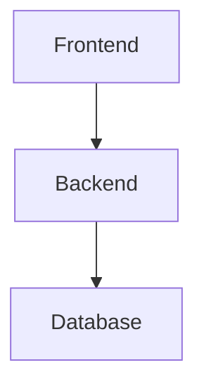

# 📥 Feature: Download Full Documentation

## Resumen

Se ha implementado exitosamente la funcionalidad de descarga directa de documentación técnica completa en formato Markdown, incluyendo diagramas Mermaid y una sección dedicada de mitigación de seguridad.

## 🎯 Características Implementadas

### 1. Función `generate_full_documentation()` en `agents/crew_agents.py`

**Ubicación:** `agents/crew_agents.py` (líneas 254-390)

**Funcionalidad:**
- Orquestación secuencial usando `crewai.Crew` con `Process.sequential`
- Generación progresiva de documentación en un solo hilo conductor
- Consolidación de múltiples secciones en un documento Markdown unificado

**Secciones Generadas:**
1. **Overview** - Visión general de tecnologías principales
2. **Arquitectura del Sistema** - Incluye diagrama Mermaid
3. **Lógica de Negocio** - Procesos core y entidades
4. **Guía de Onboarding** - Ruta recomendada de lectura
5. **Auditoría de Seguridad** - Vulnerabilidades OWASP Top 10
6. **Deuda Técnica** - Antipatrones y refactorizaciones
7. **Guía de Ejecución Correcta y Mitigación** ⭐ (NUEVA)

**Sección de Mitigación:**
```markdown
## Guía de Ejecución Correcta y Mitigación

### Comandos de Remediación
(Comandos específicos de terminal para resolver problemas)

### Recomendaciones de Seguridad
(Mejores prácticas y configuraciones seguras)

### Plan de Acción Prioritario
(Pasos ordenados por prioridad)
```

### 2. Endpoint `/download-docs` en `main.py`

**Ubicación:** `main.py` (líneas 183-318)

**Método:** `POST`

**Request Body:**
```json
{
  "github_token": "ghp_xxxxx",
  "repository": "owner/repo",
  "branch": "main",
  "filters": {
    "overview": true,
    "architecture": true,
    "business-logic": true,
    "onboarding-path": true,
    "security-audit": true,
    "technical-debt": true
  }
}
```

**Response Headers:**
```http
Content-Type: text/markdown; charset=utf-8
Content-Disposition: attachment; filename="ODST_Technical_Documentation_owner_repo.md"
Content-Length: <tamaño_en_bytes>
Cache-Control: no-cache
```

**Flujo de Ejecución:**

1. **Validación de Inputs**
   - Verifica token de GitHub
   - Valida formato del repositorio (owner/repo)

2. **Generación del AST**
   - Ejecuta `orchestrate_pipeline()` para analizar el repositorio
   - Utiliza procesamiento paralelo (hasta 8 workers)
   - Genera archivo JSON con el AST completo

3. **Generación de Documentación**
   - Invoca `generate_full_documentation(ast_data, filters)`
   - Proceso secuencial con CrewAI
   - Consolida todas las secciones en un solo documento

4. **Preparación de Descarga**
   - Convierte Markdown a bytes UTF-8
   - Crea `io.BytesIO` stream
   - Genera nombre de archivo dinámico

5. **Respuesta Streaming**
   - Retorna `StreamingResponse` con headers apropiados
   - Fuerza descarga en el navegador
   - Zero Waste: sin almacenamiento intermedio

## 🔧 Configuración de Modelos

Ambos agentes (Auditor y Escritor) utilizan:
```python
model_id="ibm/granite-8b-code-instruct"
```

**Razón:** Es el único modelo Granite de tipo "instruct" habilitado para generación de texto en el ambiente actual.

**Parámetros del Modelo:**
```python
{
    "DECODING_METHOD": "greedy",
    "MAX_NEW_TOKENS": 1500,
    "MIN_NEW_TOKENS": 50,
    "TEMPERATURE": 0.1,
    "TOP_K": 50,
    "TOP_P": 0.95,
    "REPETITION_PENALTY": 1.1
}
```

## 📊 Formato del Documento Generado

### Estructura del Markdown

```markdown
# Documentación Técnica - ODST Analysis

**Generado por:** ODST (Omniscient Documentation & Security Toolkit)

---

## Overview
[Contenido generado por el agente Writer]

## Arquitectura del Sistema

### Descripción General
[Descripción de la arquitectura]

### Componentes Principales
- Componente 1
- Componente 2

### Diagrama de Arquitectura


## Lógica de Negocio
[Contenido generado por el agente Auditor]

## Guía de Onboarding
[Contenido generado por el agente Writer]

## Auditoría de Seguridad
[Contenido generado por el agente Auditor]

## Deuda Técnica
[Contenido generado por el agente Auditor]

## Guía de Ejecución Correcta y Mitigación

### Comandos de Remediación
```bash
# Ejemplo de comandos
npm audit fix
pip install --upgrade package
```

### Recomendaciones de Seguridad
- Recomendación 1
- Recomendación 2

### Plan de Acción Prioritario
1. Acción prioritaria 1
2. Acción prioritaria 2
```

### Características del Formato

✅ **Diagramas Mermaid en Sintaxis Pura**
- Los diagramas se incluyen en bloques de código ` ```mermaid `
- NO se renderizan a HTML
- Listos para visualización en GitHub, VS Code, o cualquier visor Markdown compatible

✅ **Encoding UTF-8**
- Soporte completo para caracteres especiales
- Compatible con todos los sistemas operativos

✅ **Estructura Jerárquica**
- Headers H1 para título principal
- Headers H2 para secciones principales
- Headers H3 para subsecciones

## 🧪 Testing

### Script de Prueba: `test_download_docs.py`

**Funciones:**

1. **`test_headers_only()`** - Verificación rápida de formato de headers
2. **`test_download_docs()`** - Test completo del endpoint

**Verificaciones:**
- ✅ Status code 200
- ✅ Content-Type: text/markdown
- ✅ Content-Disposition: attachment
- ✅ Content-Length presente
- ✅ Contenido Markdown válido
- ✅ Bloques Mermaid presentes
- ✅ Sección de mitigación incluida
- ✅ Todas las secciones solicitadas generadas

**Ejecución:**
```bash
# 1. Iniciar servidor FastAPI
python main.py

# 2. En otra terminal, ejecutar test
python test_download_docs.py
```

## 🚀 Uso del Endpoint

### Ejemplo con cURL

```bash
curl -X POST http://localhost:8000/download-docs \
  -H "Content-Type: application/json" \
  -d '{
    "github_token": "ghp_xxxxx",
    "repository": "owner/repo",
    "branch": "main",
    "filters": {
      "overview": true,
      "architecture": true,
      "business-logic": true,
      "onboarding-path": true,
      "security-audit": true,
      "technical-debt": true
    }
  }' \
  --output documentation.md
```

### Ejemplo con Python (requests)

```python
import requests

url = "http://localhost:8000/download-docs"
payload = {
    "github_token": "ghp_xxxxx",
    "repository": "owner/repo",
    "branch": "main",
    "filters": {
        "overview": True,
        "architecture": True,
        "business-logic": True,
        "onboarding-path": True,
        "security-audit": True,
        "technical-debt": True
    }
}

response = requests.post(url, json=payload)

if response.status_code == 200:
    with open("documentation.md", "wb") as f:
        f.write(response.content)
    print("✅ Documentation downloaded successfully!")
else:
    print(f"❌ Error: {response.status_code}")
```

### Ejemplo con JavaScript (Frontend)

```javascript
async function downloadDocumentation() {
    const response = await fetch('http://localhost:8000/download-docs', {
        method: 'POST',
        headers: {
            'Content-Type': 'application/json',
        },
        body: JSON.stringify({
            github_token: 'ghp_xxxxx',
            repository: 'owner/repo',
            branch: 'main',
            filters: {
                overview: true,
                architecture: true,
                'business-logic': true,
                'onboarding-path': true,
                'security-audit': true,
                'technical-debt': true
            }
        })
    });

    if (response.ok) {
        const blob = await response.blob();
        const url = window.URL.createObjectURL(blob);
        const a = document.createElement('a');
        a.href = url;
        a.download = 'ODST_Technical_Documentation.md';
        document.body.appendChild(a);
        a.click();
        window.URL.revokeObjectURL(url);
        document.body.removeChild(a);
    } else {
        console.error('Download failed:', response.status);
    }
}
```

## 📝 Logs y Debugging

El endpoint genera logs detallados en cada etapa:

```
======================================================================
📥 [DOWNLOAD DOCS] New documentation download request
======================================================================
   Repository: owner/repo
   Branch: main
   Filters: {...}
======================================================================

📁 [DOWNLOAD DOCS] AST output: .../para_uriel.json

======================================================================
⚡ [DOWNLOAD DOCS] Starting AST pipeline
   Workers: 8
======================================================================

✅ [DOWNLOAD DOCS] AST file generated, loading...
✅ [DOWNLOAD DOCS] AST loaded successfully

======================================================================
📝 [DOWNLOAD DOCS] Generating full documentation
======================================================================

======================================================================
📄 [DOCUMENTATION] Starting full documentation generation
======================================================================

🚀 [DOCUMENTATION] Creating Crew with 7 sequential tasks
⚙️ [DOCUMENTATION] Executing sequential workflow...
✅ [DOCUMENTATION] Documentation generation complete!
   Total length: 15234 characters
======================================================================

======================================================================
✅ [DOWNLOAD DOCS] DOCUMENTATION READY FOR DOWNLOAD
   Repository: owner/repo
   Filename: ODST_Technical_Documentation_owner_repo.md
   Size: 15234 bytes
======================================================================
```

## ⚡ Optimizaciones Implementadas

1. **Procesamiento Paralelo del AST**
   - Hasta 8 workers simultáneos
   - Aprovecha múltiples cores de CPU

2. **Caché de LLM**
   - Evita llamadas duplicadas al modelo
   - Hash MD5 de prompts para identificación

3. **Resumen Compacto del AST**
   - Máximo 5000 caracteres
   - Extrae solo información relevante
   - Reduce consumo de tokens

4. **Zero Waste**
   - Sin archivos intermedios
   - Streaming directo al cliente
   - Menor uso de disco

## 🔒 Consideraciones de Seguridad

1. **Token de GitHub**
   - Nunca se almacena en logs
   - Se usa solo para la petición actual
   - Recomendación: usar tokens con permisos mínimos

2. **Validación de Inputs**
   - Formato de repositorio verificado
   - Branch opcional con default seguro

3. **Manejo de Errores**
   - Excepciones capturadas y logueadas
   - Mensajes de error informativos sin exponer detalles sensibles

## 📚 Archivos Modificados

1. **`agents/crew_agents.py`**
   - ✅ Nueva función `generate_full_documentation()`
   - ✅ Tarea de mitigación integrada
   - ✅ Proceso secuencial con CrewAI

2. **`main.py`**
   - ✅ Import de `StreamingResponse`
   - ✅ Import de `generate_full_documentation`
   - ✅ Nuevo endpoint `/download-docs`

3. **`test_download_docs.py`** (NUEVO)
   - ✅ Suite de pruebas completa
   - ✅ Verificación de headers
   - ✅ Validación de contenido

4. **`DOWNLOAD_DOCS_FEATURE.md`** (NUEVO)
   - ✅ Documentación completa de la feature

## 🎉 Resultado Final

La implementación permite:

✅ Descarga directa de documentación técnica completa
✅ Formato Markdown con diagramas Mermaid puros
✅ Sección dedicada de mitigación y remediación
✅ Headers HTTP correctos para forzar descarga
✅ Zero Waste: sin almacenamiento intermedio
✅ Logs detallados para debugging
✅ Suite de pruebas incluida
✅ Compatible con cualquier visor Markdown

## 🔄 Próximos Pasos Sugeridos

1. **Integración con Frontend**
   - Añadir botón "Download Full Documentation" en la UI
   - Implementar barra de progreso durante la generación
   - Mostrar preview del documento antes de descargar

2. **Mejoras de Performance**
   - Implementar caché de documentos generados
   - Añadir opción de generación asíncrona con webhook

3. **Personalización**
   - Permitir templates personalizados
   - Añadir opciones de formato (PDF, HTML, DOCX)
   - Incluir logo y branding personalizado

4. **Análisis Avanzado**
   - Integrar más herramientas de análisis estático
   - Añadir métricas de complejidad ciclomática
   - Incluir análisis de dependencias vulnerables

---

**Implementado por:** Bob (AI Software Engineer)
**Fecha:** 2026-05-17
**Versión:** 1.0.0