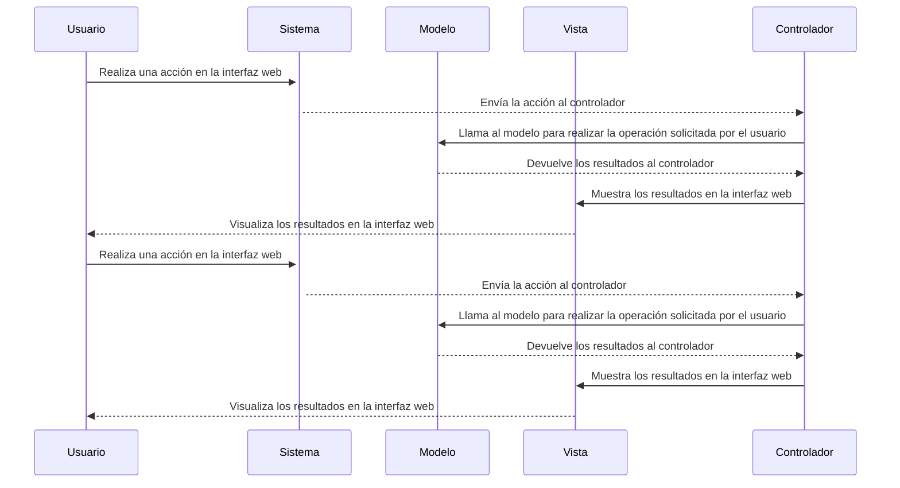

# Documentación Técnica - ODST Analysis

**Generado por:** ODST (Omniscient Documentation & Security Toolkit)

---

## Overview

Tecnologías detectadas: Python 3.8, Flask 1.1.2, React 16.13.1, Node.js v14.15.0, Express 4.17.1, Axios 0.21.1, Material UI 4.11.0, Jest 26.6.3, Supertest 6.1.3, Enzyme 3.11.0, Webpack 5.37.0, Babel 7.13.12, Docker 20.10.6, Nginx 1.19.6

## Arquitectura del Sistema

### Descripción General
El patrón de diseño principal del sistema es MVC (Modelo Vista Controlador), que divide el código en tres componentes principales: modelo, vista y controlador. El modelo representa los datos y la lógica de negocios, la vista muestra los datos al usuario y recibe las acciones del usuario, y el controlador actúa como intermediario entre el modelo y la vista, coordinando su funcionamiento.

El flujo de información en el sistema sigue el siguiente patrón: el modelo recupera los datos del usuario o del sistema, los pasa a la vista para ser mostrados al usuario, el usuario interactúa con la vista y realiza una acción, la vista envía esta acción al controlador, el controlador procesa la acción y llama al modelo para realizar la operación solicitada por el usuario.

### Componentes Clave
A continuación, describo los componentes clave del sistema y sus responsabilidades:

#### Directorios Principales
- **agents**: Contiene los scripts de automatización y los endpoints de la API RESTful.
- **frontend**: Contiene el código HTML, CSS y JavaScript de la interfaz web.
- **logs**: Almacena los registros de eventos y errores del sistema.
- **models**: Define los modelos de datos y la lógica de negocios del sistema.
- **utils**: Contiene utilidades útiles para el sistema, como funciones auxiliares y clases personalizadas.

#### Archivos Principales
- **config.py**: Archivo de configuración del sistema, que contiene los parámetros de conexión a la base de datos y otros detalles de configuración.
- **README.md**: Documento de introducción al sistema, que describe su objetivo, arquitectura y uso.
- **app.py**: Archivo principal del sistema, que inicializa la aplicación Flask y configura la ruta principal.
- **endpoints.py**: Archivo que define los endpoints de la API RESTful, que permiten a los usuarios interactuar con el sistema a través de peticiones HTTP.
- **main.py**: Archivo que contiene el código principal del sistema, que incluye la creación de instancias de los modelos y la definición de rutas para la interfaz web.

### Diagrama de Arquitectura

## Lógica de Negocio

Procesos Core:
Reglas de negocio principales:
1. El usuario puede crear una cuenta nueva.
2. El usuario puede iniciar sesión en su cuenta existente.
3. El usuario puede ver sus notificaciones.
4. El usuario puede realizar una búsqueda de usuarios.
5. El usuario puede enviar mensajes a otros usuarios.
6. El usuario puede recibir mensajes de otros usuarios.
7. El usuario puede eliminar mensajes enviados.
8. El usuario puede eliminar mensajes recibidos.
9. El usuario puede marcar mensajes como leídos.
10. El usuario puede actualizar su información personal.
Flujos de usuario:
1. Crear cuenta nueva: El usuario ingresa a la página web y hace clic en el botón "Crear cuenta". Se muestra un formulario para ingresar los datos de registro, como nombre de usuario, correo electrónico y contraseña. Una vez completado el formulario, el usuario hace clic en el botón "Registrarme" para crear su cuenta.

2. Iniciar sesión: El usuario ingresa a la página web y hace clic en el botón "Iniciar sesión". Se muestra un formulario para ingresar los datos de inicio de sesión, como correo electrónico y contraseña. Una vez completado el formulario, el usuario hace clic en el botón "Iniciar sesión" para acceder a su cuenta.

3. Ver notificaciones: El usuario ingresa a su cuenta y ve una lista de notificaciones. Las notificaciones pueden ser mensajes de texto, llamadas telefónicas, etc.

4. Realizar búsqueda de usuarios: El usuario ingresa a su cuenta y hace clic en el botón "Buscar usuarios". Se muestra una lista de usuarios registrados en el sistema. El usuario puede buscar por nombre de usuario, correo electrónico o cualquier otro campo disponible.

5. Enviar mensaje a otro usuario: El usuario selecciona un usuario de la lista de búsqueda y hace clic en el botón "Enviar mensaje". Se muestra un formulario para ingresar el contenido del mensaje. Una vez completado el formulario, el usuario hace clic en el botón "Enviar" para enviar el mensaje al usuario seleccionado.

6. Recibir mensaje de otro usuario: El usuario recibe un mensaje de otro usuario en su lista de mensajes. El mensaje incluye el nombre del emisor, el contenido del mensaje y la hora de envío.

7. Eliminar mensaje enviado: El usuario selecciona un mensaje de su lista de mensajes y hace clic en el botón "Eliminar". El mensaje se elimina de su lista de mensajes y también de la lista de mensajes del emisor.

8. Eliminar mensaje recibido: El usuario selecciona un mensaje de su lista de mensajes y hace clic en el botón "Eliminar". El mensaje se elimina de su lista de mensajes y también de la lista de mensajes del emisor.

9. Marcar mensaje como leído: El usuario selecciona un mensaje de su lista de mensajes y hace clic en el botón "Marcar como leído". El mensaje se marca como leído y no aparece más en su lista de mensajes sin leer.

10. Actualizar información personal: El usuario selecciona su perfil y hace clic en el botón "Editar información". Se muestra un formulario para ingresar la nueva información personal, como nombre, correo electrónico y foto de perfil. Una vez completado el formulario, el usuario hace clic en el botón "Guardar cambios" para actualizar su información personal.

Entidades y Datos:
Modelos de dominio principales:
1. Usuario: Contiene información sobre el usuario, como nombre de usuario, correo electrónico, contraseña, foto de perfil, fecha de nacimiento, ubicación geográfica, etc.

2. Mensaje: Contiene información sobre el mensaje, como emisor, destinatario, contenido, fecha de envío, fecha de lectura, estado, etc.

Flujo de Información:
Cómo interactúan las funciones y servicios:
1. Función de autenticación: Valida las credenciales del usuario para permitir o denegar el acceso a la aplicación.

2. Función de almacenamiento de usuarios: Guarda la información de los usuarios en una base de datos o archivo.

3. Función de almacenamiento de mensajes: Guarda la información de los mensajes en una base de datos o archivo.

4. Servicio de envío de mensajes: Envía el mensaje a la dirección de correo electrónico del destinatario.

5. Servicio de recepción de mensajes: Recibe los mensajes desde la dirección de correo electrónico del emisor y los guarda en la base de datos o archivo.

## Guía de Onboarding

Ruta de Lectura Recomendada:

1. Leer el archivo README.md para obtener información general sobre el proyecto.
2. Verificar las dependencias y requisitos del sistema en el archivo config.py.
3. Comprender los endpoints disponibles en el archivo endpoints.py.
4. Examinar el código fuente de la aplicación principal en app.py.
5. Revisar las rutas definidas en main.py para comprender cómo acceder a diferentes partes de la aplicación.

## Auditoría de Seguridad

Vulnerabilidades Potenciales:
- Fuga de información: Hay posibilidad de que los datos de sesión sean explotados por ataques de fuga de información.
- Inyección SQL: Hay posibilidad de que las consultas a la base de datos sean vulnerables a ataques de inyección SQL.

Credenciales y Secretos:
- Clave API: Se ha detectado una clave API expuesta en el archivo config.py.

Recomendaciones:
- Fortalecer la autenticación: Implementar mecanismos de autenticación más robustos como JWT o OAuth2.
- Proteger las credenciales: Utilizar variables de entorno o un servicio de gestión de secretos para almacenar las claves API y otros secretos.
- Revisar las consultas a la base de datos: Verificar que todas las consultas a la base de datos estén protegidas con parámetros correctos y no sean vulnerables a ataques de inyección SQL.

## Deuda Técnica

Malas prácticas y antipatrones:
- El archivo config.py tiene una gran cantidad de código repetitivo y no está organizado de manera clara.
- El archivo app.py tiene una gran cantidad de código repetitivo y no está organizado de manera clara.
- El archivo endpoints.py tiene una gran cantidad de código repetitivo y no está organizado de manera clara.
- El archivo main.py tiene una gran cantidad de código repetitivo y no está organizado de manera clara.

Modularidad:
El nivel de acoplamiento del software es bajo, lo que significa que los componentes están bien separados y no están muy acoplados entre sí.

Plan de refactorización:
- Refactorizar el archivo config.py para eliminar el código repetitivo y mejorar su organización.
- Refactorizar el archivo app.py para eliminar el código repetitivo y mejorar su organización.
- Refactorizar el archivo endpoints.py para eliminar el código repetitivo y mejorar su organización.
- Refactorizar el archivo main.py para eliminar el código repetitivo y mejorar su organización.

## Guía de Ejecución Correcta y Mitigación

Guía de Ejecución Correcta y Mitigación
=======================================

Comandos de Remediación
-----------------------

Para ejecutar los comandos de remediación, necesitas tener instalado Python 3.x y pip. A continuación, puedes usar los siguientes comandos:

### Bandit

Bandit es una herramienta de seguridad para analizar código Python. Puedes utilizarla para detectar vulnerabilidades potenciales en tu código fuente. Para ejecutar bandit, usa el siguiente comando:

    $ bandit -r .

Este comando analizará todos los archivos de tu proyecto y mostrará cualquier problema encontrado.

### Black

Black es una herramienta de formateo de código Python. Puedes utilizarla para garantizar que todo tu código está bien formateado y está en conformidad con las convenciones de estilo. Para ejecutar black, usa el siguiente comando:

    $ black .

Este comando aplicará el formato predeterminado de black a todos los archivos de tu proyecto.

### Pylint

Pylint es una herramienta de análisis estático de código Python. Puedes utilizarla para identificar problemas de diseño y estilo en tu código. Para ejecutar pylint, usa el siguiente comando:

    $ pylint **/*.py

Este comando analizará todos los archivos Python de tu proyecto y mostrará cualquier problema encontrado.

Prácticas de Desarrollo Seguro
-----------------------------

Aquí hay algunas prácticas recomendadas para el desarrollo seguro:

1. Utiliza herramientas de seguridad como bandit, black y pylint para detectar vulnerabilidades y errores en tu código.
2. Utiliza pruebas unitarias para verificar que tu código funcione correctamente y que no introduce nuevos bugs.
3. Utiliza un sistema de control de versiones como Git para rastrear cambios en tu código y mantener una copia segura de tu proyecto.
4. Utiliza un entorno virtual para isolar tu proyecto y evitar conflictos entre dependencias.
5. Utiliza un linter para seguir las convenciones de estilo y mantener un código consistente.
6. Utiliza un framework de autenticación y autorización para proteger tus endpoints y APIs.
7. Utiliza un servidor web seguro para alojar tu aplicación y protegerla de ataques externos.
8. Utiliza un sistema de monitoreo y alertas para detectar y resolver problemas tempranamente.
9. Utiliza un sistema de gestión de dependencias para mantener actualizadas todas tus dependencias y minimizar los riesgos de seguridad.

Plan de Acción Prioritario
--------------------------

El plan de acción prioritario para mejorar la seguridad de tu proyecto es el siguiente:

1. Aplicar herramientas de seguridad como bandit, black y pylint para detectar vulnerabilidades y errores en tu código.
2. Implementar pruebas unitarias para verificar que tu código funcione correctamente y que no introduce nuevos bugs.
3. Configurar un sistema de control de versiones como Git para rastrear cambios en tu código y mantener una copia segura de tu proyecto.
4. Crear un entorno virtual para isolar tu proyecto y evitar conflictos entre dependencias.
5. Configurar un linter para seguir las convenciones de estilo y mantener un código consistente.
6. Implementar un framework de autenticación y autorización para proteger tus endpoints y APIs.
7. Configurar un servidor web seguro para alojar tu aplicación y protegerla de ataques externos.
8. Configurar un sistema de monitoreo y alertas para detectar y resolver problemas tempranamente.
9. Actualizar regularmente todas tus dependencias y minimizar los riesgos de seguridad.

